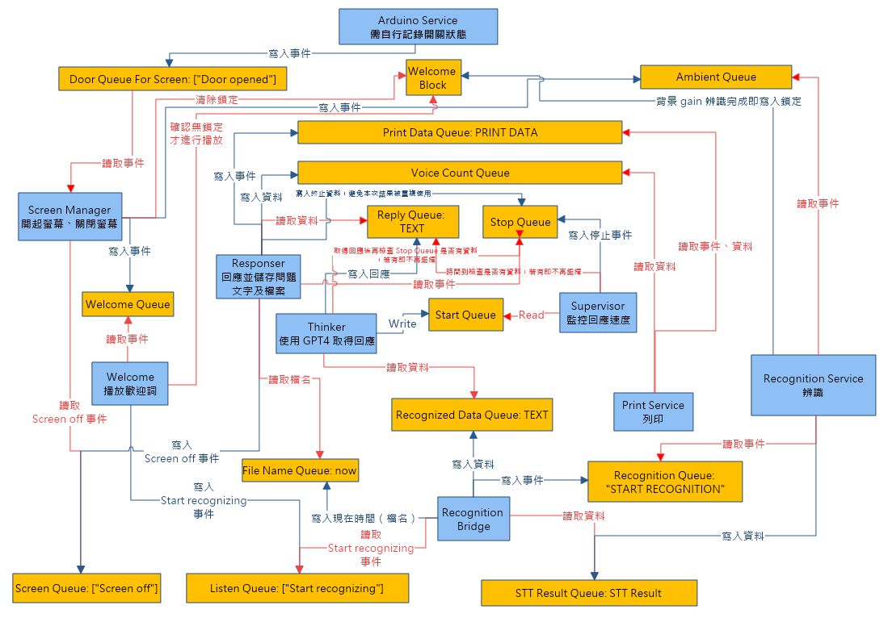

# Confession

A underlying service of techno-art "告解室".

## Project Structure

The repository includes:

*   **Core Logic:** Python scripts (`main.py`, `zh_stt_tts_print.py`, `audio_wave_form*.py`, `video_*.py`, etc.)
*   **Hardware Interface:** Code for an Arduino door sensor (`arduino_door_sensor/`).
*   **User Interface:** Potentially Qt-based (`audio_wave_form_qt.py`) and HTML.
*   **Build/Packaging:** Files for creating a Windows executable and installer (`boot_loader.*`, `build/`, `dist/`).
*   **Assets & Output:** Directories for static files (`assets/`) and generated output (`Output/`, `storage/`).
*   **Documentation:** Architecture diagrams (`architecture.png`, `sequence diagram.mermaid`).

## Features

*   Audio recording and waveform visualization.
*   Video playback/processing (using Pygame).
*   Chinese Speech-to-Text (STT).
*   Chinese Text-to-Speech (TTS).
*   Printing functionality.
*   Interaction with an Arduino-based door sensor.
*   Graphical User Interface (potentially using PyQt).
*   Packaged as a Windows application.

## Architecture



Visual representations of the project architecture are available:

*   `architecture.png`
*   `sequence diagram.mermaid` (Viewable in tools/editors that support Mermaid syntax)

## Getting Started

### Prerequisites

*(List any software, hardware, or accounts needed before installation)*

*   Python 3.x
*   Pip (Python package installer)
*   Arduino IDE (if modifying Arduino code)
*   Hardware: Arduino board, door sensor, microphone, speakers, printer? *(Specify required hardware)*
*   *(Any other dependencies? e.g., specific Windows versions, external APIs)*

### Dependencies

The `requirements.txt` file is currently empty. You should populate it with the necessary Python libraries. Based on the code files, potential dependencies might include:

*   `PyQt5` or `PySide2` (for GUI)
*   `pygame` (for video)
*   `pyaudio` (for audio I/O)
*   `numpy` / `matplotlib` (for waveforms)
*   `requests` (if interacting with web APIs)
*   *(Specific STT/TTS libraries used, e.g., `SpeechRecognition`, `gTTS`, `google-cloud-speech`?)*
*   *(Libraries for printing?)*
*   `pyinstaller` (for building the executable)

To install dependencies (once `requirements.txt` is populated):
```bash
pip install -r requirements.txt
```

### Installation

1.  Clone the repository:
    ```bash
    git clone https://github.com/LZong-tw/confession.git
    cd confession
    ```
2.  Install Python dependencies (see above).
3.  Set up the Arduino board with the code in `arduino_door_sensor/`.

### Running the Application

*(Explain how to run the main script or the packaged executable)*

*   **Development:**
    ```bash
    python main.py
    ```
*   **Packaged Executable:** Run `boot_loader_ready.exe` (or the installer generated from `boot_loader_setup.iss`).
